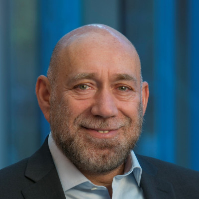

# Organizers

 [Vinayshekhar Bannihatti Kumar](https://vinayshekhar000.github.io/)  (AWS AI Labs)

**Bio**: Vinayshekhar Bannihatti Kumar is an Applied Scientist at AWS AI Labs working on natural language interfaces for AWS Customers. 
His current research focuses on building large language models with the theme of making AWS easier to use. 
He works on generation tasks with a goal to allow conversational systems to produce engaging content to users. 
He has published papers in creative content generation, summarization and legal document analysis. 
Prior to joining Amazon, he graduated with Masters in Language technology where he was building NLInt for making privacy policies more comprehensible. 
He has also served on the program committee of various top tier conferences like ACL, NAACL, AAAI, 
 
 
 

 [Sopan Khosla](https://sopankhosla.github.io/) (AWS AI Labs)

**Bio**: Sopan Khosla is an Applied Scientist in AWS AI, Amazon. Currently, his research focus is in the area of Conversational AI. He has previously worked  and published papers on problems relating to anaphora resolution in dialogue, discourse modeling, information extraction, and dialogue summarization.
    Prior to joining Amazon, he graduated with Masters in Language Technologies from Carnegie Mellon University where he worked on information extraction and summarization from Physician-Patient conversations. Before that, he was a Research Engineer at Adobe Research where his research centered around online customer behavior modeling, and affect modeling from NL interactions. Sopan has organized shared tasks on resolving different types of anaphoric relations in conversations at CODI-CRAC workshops co-located with EMNLP'21 and COLING'22.
 
 
 

 [Rashmi Gangadharaiah](https://www.amazon.science/author/rashmi-gangadharaiah) (AWS AI Labs)

**Bio**: Dr. Rashmi Gangadharaiah is a Principal Machine Learning scientist in AWS AI, Amazon. She currently works in the area of Conversational AI. She has previously worked on applications in the areas of healthcare analytics, question answering, Information Retrieval(IR). She was previously a Research Staff Member at IBM Research where she worked on knowledge discovery and interactive dialog systems in customer support settings. She was also a postdoctoral scholar at UCSD where built an interactive decision support system for differential diagnosis. Dr. Gangadharaiah earned her PhD in information technology, artificial intelligence, and machine learning from Carnegie Mellon University. She has experience organizing workshops (NLP4MC at ACL'20, NLP4MC at NAACL'21) and Industry Tracks (NAACL'22 Industry Track Chair) at top-tier NLP/ML conferences.
 
 
 

 [Scott Wen-tau Yih](http://scottyih.org/) (Facebook AI Research)

**Bio**: Scott is a Research Scientist at Meta AI -- FAIR. His research interests include NLP, ML and IR. Before joining Meta, Yih was a Principal Research Scientist at the Allen Institute for Artificial Intelligence (AI2), working on scientific question answering. Prior to that, Yih had spent 12 years at Microsoft Research, working on a variety of projects including email spam filtering, and search \& ad relevance. His recent work focuses on continuous representations for question answering and document retrieval. Yih received the best paper award from CoNLL’11, an outstanding paper award from ACL’15 and has served as program co-chairs (CEAS’09, CoNLL’14, EMNLP’21) and action/associated editors (TACL, JAIR) in recent years. He is also a co-presenter for several popular tutorials on topics including Semantic Role Labeling (NAACL’06, AAAI’07), Deep Learning for NLP (SLT’14, NAACL’15, IJCAI’16) and Open-domain Question Answering (ACL’20).
 
 
 

 [Ahmed Hassan Awadallah](https://www.microsoft.com/en-us/research/people/hassanam/) (Microsoft Research)

**Bio**: Ahmed is a senior principal research manager at Microsoft research where he leads multidisciplinary efforts working at the intersection of machine learning and natural language processing. His current work focuses on making AI models more efficient, adaptable and collaborative. His earlier work spanned topics including information extraction, summarization, measuring and improving search systems via user behavior modeling and building natural language interfaces to services and data. He was a co-organizer of multiple workshops and co-presenter of several tutorials in venues related to ML, NLP and IR. He regularly serves as (senior) area chair, (senior) committee member, guest editor and editorial board member at many major ML, NLP and IR venues.
 
 
 

 [Tania Bedrax-Weiss](https://research.google/people/105765/)(Google Research)

**Bio**: Tania Bedrax Weiss is a Senior Director of Research at Google. Her current focus is on identifying untapped problems at the intersection of Machine Learning, Natural Language Understanding, Vision, and Interaction Systems at Google.  She manages a team of 120+ researchers and spends most of her time defining and outlining research agendas to advance the state-of-the-art and bring transformative capabilities to Google products. During the 15+ years she’s been at Google she has launched transformative products in Search, Ads, and Google Play. Previously, she worked at NASA Ames Research Center and was part of the team that wrote the software used to schedule daily observations for Spirit and Opportunity, part of the Mars Exploration Rovers mission. Before that, Tania worked in industry applying machine intelligence techniques to program automated configuration and pricing systems. She holds a PhD from the University of Oregon in Artificial Intelligence.
 
 
 

 [Dan Roth](https://scholar.google.com/citations?user=E-bpPWgAAAAJ&hl=en)(AWS AI Labs)

**Bio**: Dan Roth is a VP/Distinguished Scientist in AWS AI Labs, Leading NLP Science for AWS Services, the Eduardo D. Glandt Distinguished Professor at the Department of CIS, UPenn, and a Fellow of the AAAS, ACM, AAAI, and ACL. Dan has published broadly (over 450 papers) in NLP, ML, knowledge representation and reasoning, and learning theory and he was awarded the John McCarthy Award in 2017. He was the Editor-in-Chief of the Journal of Artificial Intelligence Research (JAIR) and has served as a Program Chair and Conference Chair for the major conferences in his research areas (e.g NAACL 2022). Dan has been involved in several startups; most recently he was a co-founder and chief scientist of NexLP. NexLP was acquired by Reveal in 2020. Dan received his Ph.D. in Computer Science from Harvard University in 1995.
 
 
 

 [Katrin Kirchoff](https://www.amazon.science/author/katrin-kirchhoff) (AWS AI Labs)

**Bio**: Katrin is a Director of Applied Science at Amazon Web Services, where she heads several teams in speech and audio processing. She was a Research Professor at the UW, Seattle, for 17 years, where she co-founded the Signal, Speech and Language Interpretation Lab. She served on the editorial boards of Speech Communication and Computer, Speech, and Language, and was a member of the IEEE Speech Technical Committee.
 
 
 